# Three.JS Tutorial - Create 3D Environments with HTML and JavaScript

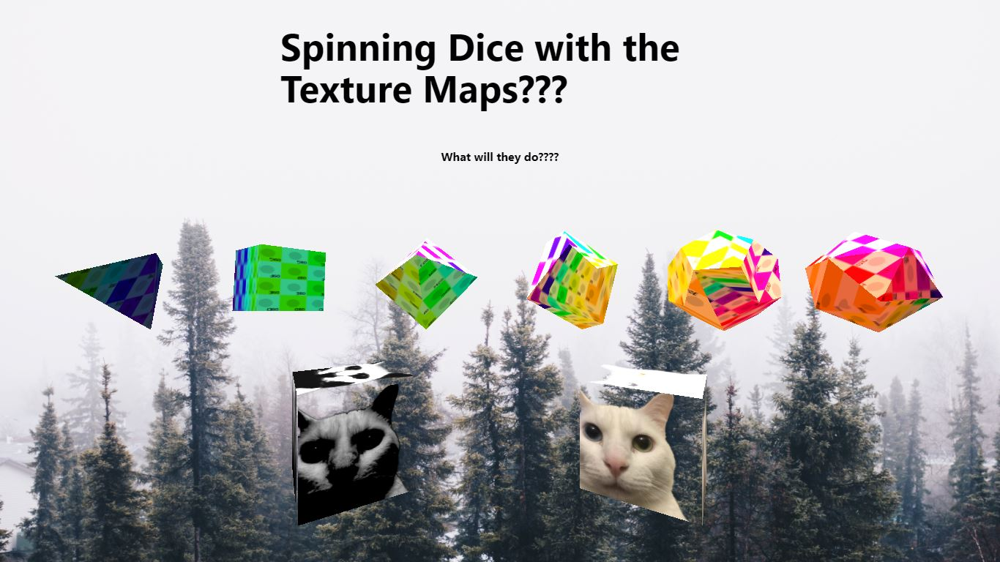

Check out an example:
[Three.js Blog](https://am0eba-byte.github.io/internshipblog-3js/)

See other awesome things you can do with three.js:
[Three.JS examples page](https://threejs.org/examples/#webgl_animation_keyframes)


## Step 1: *Install the Three.JS node package module using your Terminal/Command Line*

Before we dive into making our awesome 3D website, we need to install `Node.js` and `npm` at the command line.

  -Before we dive into making our awesome 3D website, we need to install <code>Node.js</code> and
            <code>npm</code>
            at the command line. 
  -We strongly recommend writing your code in [JetBrains' WebStorm](https://www.jetbrains.com/webstorm/download/), 
                which we will explore as an alternative
            to the oXygen XML Editor for working intensively on JavaScript projects.


### **Install Node.js**

Node.JS is what makes the JavaScript world go round. 

"As an asynchronous event-driven JavaScript runtime, Node.js is designed to build scalable network applications." *-Node.JS devs*

Before downloading Node.JS, you should check to see if you already have it installed in your machine.
To do this, we will open our Command Line.

- **Hot tip part 2:** VS code actually has a command line terminal built into the editor that you can use as well:

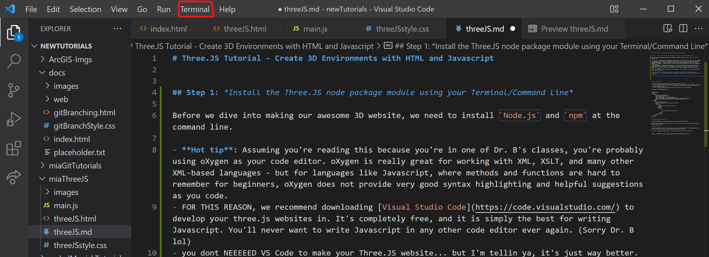

- Enter this command to check if you already have Node.JS Installed:
  ```
    node -v
  ```

 If you already have Node.JS installed, the terminal will print a version number that looks something like this: `v0.10.35`

 If your terminal didn't print a version number, you need to go [download Node.JS](https://nodejs.org/en/). (Don't worry, it's completely free - and if you really want to get into JavaScript on any level, including professionally, Node.JS is a must-have.)

 ### **Install NPM**

Now that you have Node.JS installed, allow me to introduce you to the wonderful world of the **[Node Package Manager (NPM)](https://www.npmjs.com/)** community. NPM allows brilliant developers to write awesome open-source Node.JS package modules that will allow you to do super cool things with JavaScript, including make 3D websites. We need to install NPM at the command line in order to install the Three.JS package.

- First, check to see if you already have NPM installed:

```
npm -v
```

Again, similar to when we checked for node.js, a version number will print if you already have npm installed. 
- If not, you need to install it. We can do this at the command line with this command:

```
npm install -g npm
```

Now you're all set to create your new project repository!

### **Install VITE**

Once you have made your project directory, open the command line  and enter this command:


```
npm init vite
```
Follow the prompts given at command line:

- name your project
- name your package (press enter for default)
- select `vanilla` framework (yellow)
- select `JavaScript` for the language (yellow)

* **NOTE** If you cannot select with the arrow keys on your Windows computer, 
switch to Windows Powershell or Windows terminal (instead of Git Bash)

This will create some new files in your directory.

### Install Three.JS at command line

enter this command:

```
npm install --save three
```

You should see a new `node_modules` directory, a `package.json` file, and a `package-lock.json` file. 

- **DO NOT TOUCH THESE THINGS**

These files and directory contain dependencies that NPM automagically generates for you. Humans do not need to touch them directly, and should never touch them for any reason at all - *or you'll destroy the planet*

You should now have a project directory with everything you need to begin. If you have trouble installing vite, create a new folder within your project and install there. After vite finishes downloading, move `node_modules` into your root folder.


## Write your HTML

You'll need three basic elements in your HTML to render your 3D world:
- `<canvas>` with a unique `@id` that will literally act as the canvas for your 3D objects to live in.
- `<script type="module" src="./main.js">` to connect your HTML to your JavaScript file with all of the 3D instructions inside it.
- `<main>` to hold the text contents that will float on top of your 3D environment.

It should look something like this:

```
<!DOCTYPE html>
<html lang="en">
    <head>
        <title>ThreeJS Web Demo</title>
        <link rel="stylesheet" type="text/css" href="style.css" />
        <title>Three JS Demo</title>
        <meta charset="UTF-8" />
        <meta name="viewport" content="width=device-width, initial-scale=1.0" />
    </head>
    <body>
        <main class="text">
            <h1>Spinning Dice with the Texture Maps???</h1>
            <h4>What will they do????</h4>
        </main>
        <canvas id="bg"></canvas>
        <script type="module" src="main.js"></script>
    </body>
</html>
```

Keep in mind that our Three.JS visuals will only show up from our `canvas` tags, anything else should be put inside `main`.

## Create your background canvas by editing your CSS

In the same directory as your index.html file, you should find a CSS file called `style.css`. Write the following code into that CSS to make the `<canvas>` element in your HTML be the background for your site:

```
canvas{
  position:fixed;
  top: 0;
  left: 0;
}
```

This is where your 3D objects will appear when we start creating them in your JavaScript.


# HOW TO VIEW YOUR SITE LOCALLY

Since Three.JS requires dependencies in order to render, you need to tell your app to run in the command line every time you make changes in order to view it locally.

In the command line terminal, run this command:

```
npm run dev
```

a `localhost` link should appear in the command line. Copy it, and paste it in your browser to view your app.


# JavaScript Time!

In your new `main.js` JavaScript file, you'll need to tell it to import the Three.JS node package module in order to reference the many pre-built 3D-building methods and objects.

To do this, simply paste these `import` instructions on the first line of your JS file:

```
import * as THREE from 'https://cdn.skypack.dev/three@0.128.0/build/three.module.js';
```

Although we can import Three as `import * as THREE from 'three'`, we reference an installation pack instead. This lets the published site to use Three without referencing local or make us push the package to GitHub.  

Other JavaScript packages should be done in the same way for this project.

## Scene Setup

[Helpful Three.JS documentation in case you need it](https://threejs.org/docs/index.html#manual/en/introduction/Creating-a-scene)

You need three main components to set up your Three.JS scene:

- a new scene
- a camera
- a renderer

We create these objects by declaring a new `const`, a type of variable in JavaScript, and defining it with new THREE methods.

```
// Setup

const scene = new THREE.Scene();

const camera = new THREE.PerspectiveCamera(75, window.innerWidth / window.innerHeight, 0.1, 1000);


// create a new renderer by instating the canvas element in our HTML // file
const renderer = new THREE.WebGLRenderer({
  canvas: document.querySelector('#bg'),
});
```

You will not be able to view your new scene until you tell the renderer to render the scene and the camera with Three.js's `.render` method:

```
renderer.render(scene, camera);
```


Now that we have each of these objects set as constants, we can manipulate them with Three.JS's built-in methods. 

Let's set the pixel ratio, the size, and the camera position:

```
renderer.setPixelRatio(window.devicePixelRatio);
renderer.setSize(window.innerWidth, window.innerHeight);
camera.position.setZ(50);
camera.position.setX(-3);

```


## Create your first object!

Now that our scene is set up, we can add 3D objects! 

There are three basic components you need in order to create a 3D object in Three.JS:

- the geometry
- the material
- the mesh (combining the geometry and the material)

Three.JS already has some helpful geometries in the package! In this example we want to create a full set of dice that might be used for DND. To do this we need 
- a tetrahedron (d4), 
- a cube (d6),
- an octahedron (d8),
- a pentagonal trapezohedron (d10),
- a dodecahedron (d12)
- and an icosahedron (d20)

Fortunately, Three.JS gives us proper geometry for everything except our 6-sided and 10-sided dice. We'll get into those two in a little, first lets try creating a tetrahedron.

We need to create new `const` variables for each of these components so that we may manipulate them and add the final mesh to our scene.

  - The dimensions of the length, width, and height of your box go inside the new THREE geometry object parentheses `()` as arguments separated by commas:

```
// Tetrahedron
const d4 = new THREE.TetrahedronGeometry(7);
//set the color of the basic material in the object parameters `{}`
const d4Material = new THREE.MeshStandardMaterial({color: 0x264653 });
const d4Mesh = new THREE.Mesh(d4, d4Material);
```

To add our 4-sided dice into the scene, use the `.add()` method.

```
scene.add(d4Mesh);
```

You're shape should now be running on your local host! This process can be repeated using the proper names of the shapes in Three.JS. We continue by using `THREE.OctahedronGeometry`, `THREE.DodecahedronGeometry`, and `THREE.IcosahedronGeometry`

Now lets get into making a PROPER cube.

## Making a Cube

Three.JS has a built in geometry for a cube or rectangle. The length, width, and depth of `THREE.BoxGeometry` can be specified to create a cube, and it's pretty good.

However, as we continue this tutorial we will get into texture maps. Our issue is that textures don't wrap nicely around `BoxGeometry`, instead the image is repeated on all sides. If you don't care about texture maps, then this Box code should work for you.

```
const d6 = new THREE.BoxGeometry(7);
const d6Material = new THREE.MeshStandardMaterial({ color: 0x2a9d8f });
const d6Mesh = new THREE.Mesh(d6, d6Material);
```

Depending on your needs you might want a full wrap around the cube or not. If you want a full wrap, we're going to make a cube that's bigger, Better, STRONGER.


## Making the BETTER Cube

In Three.JS, all `geometry`s are made up of two things: **verticies** and **faces**. Verticies are point coordinates in a 3D space, and faces are triangles that connect verticies.

It isn't difficult to make our own cube mesh and we follow a lot of the same steps. First though, we want to make our own geometry. Start by making `const` variables for the vertices and indicies like this:

```
// Cube
const verticesOfCube = [
    -1,-1,-1,    1,-1,-1,    1, 1,-1,    -1, 1,-1,
    -1,-1, 1,    1,-1, 1,    1, 1, 1,    -1, 1, 1,
];

const indicesOfFaces = [
    2,1,0,    0,3,2,
    0,4,7,    7,3,0,
    0,1,5,    5,4,0,
    1,2,6,    6,5,1,
    2,3,7,    7,6,2,
    4,5,6,    6,7,4
];
```
These faces and indicies were shamelessly stolen from threejs.org on their [PolyhedronGeometry page](https://threejs.org/docs/?q=poly#api/en/geometries/PolyhedronGeometry). It's also interesting to mess around with the numbers and see what happens.

Three.JS's `PolyhedronGeometry` allows us to define our own indicies and faces in space. We can now continue making the geometry, material, and mesh the same way as the other shapes.

```
const d6 = new THREE.PolyhedronGeometry( verticesOfCube, indicesOfFaces, 7);
const d6Material = new THREE.MeshStandardMaterial({ color: 0x2a9d8f });
const d6Mesh = new THREE.Mesh(d6, d6Material);
```

This should give us a cube that wraps the texture around the mesh. Don't forget to add the mesh to the scene.

```
scene.add(d6Mesh);
```

The next shape we need to make is a pentagonal trapezohedron.

## Making a Pentagonal Trapezohedron


For this shape we follow along with parts of [this tutorial](https://aqandrew.com/blog/10-sided-die-react/) to create the face and verticies. The reason Three.JS doesn't have a geometry for a d10 is because there isn't a 3D shape where each face has 10 equal sides.

To make our own 10-sided die, we're going to first call the faces and vertices.

```
const sides=10
const vertices = [
    [0, 0, 1],
    [0, 0, -1],
].flat();

for (let i = 0; i < sides; ++i) {
    const b = (i * Math.PI * 2) / sides;
    vertices.push(-Math.cos(b), -Math.sin(b), 0.105 * (i % 2 ? 1 : -1));
}

const faces = [
    [0, 2, 3],
    [0, 3, 4],
    [0, 4, 5],
    [0, 5, 6],
    [0, 6, 7],
    [0, 7, 8],
    [0, 8, 9],
    [0, 9, 10],
    [0, 10, 11],
    [0, 11, 2],
    [1, 3, 2],
    [1, 4, 3],
    [1, 5, 4],
    [1, 6, 5],
    [1, 7, 6],
    [1, 8, 7],
    [1, 9, 8],
    [1, 10, 9],
    [1, 11, 10],
    [1, 2, 11],
].flat();
```

A for loop calculates a full array for our vertices around the ring of the die, the faces have already been calculated. More info about the function can be found in the tutorial page listed above.

After that, we want to define the geometry, the material, and the mesh.

```
const d10 = new THREE.PolyhedronGeometry( vertices, faces, 7 );
const d10Material = new THREE.MeshStandardMaterial({ color: 0xe9c46a });
const d10Mesh = new THREE.Mesh(d10, d10Material);
```

Add the mesh to the scene.

```
scene.add(d10Mesh);
```

So long as you can find verticies and faces or you're willing to make them yourself, you can make any geometry you want. If all went well, you should have six different shapes on your localhost! 

## Manipulating your object

You can change the position of the object by manipulating the Mesh's `.position` property and attaching the axis on which you want to move it:

```
d4Mesh.position.x = -15;
d4Mesh.position.y = 0;
d4Mesh.position.z = -15;
```

The `x` value changes horizontal position, the `y` value vertical, and `z` changes the depth of the object.

You can change the rotation of your object by manipulating the `.rotation` property and attaching the axis on which you wish to rotate it:

```
d4Mesh.rotation.x = 2;
d4Mesh.rotation.y = .5;
```

## Lights and Material Types

Three.JS allows you to create objects with a wide variety of customizable material types and textures. Some material types require lights in the scene in order to be visible, including the `Phong` material. Your cube is visible because it is made of a `Basic` material, which is not affected by lights.

Let's create a new object to test out new materials:

```
const d20 = new THREE.IcosahedronGeometry(7);
const d20Material = new THREE.MeshStandardMaterial({map: testTexture, color: 0xe76f51 });
const d20Mesh = new THREE.Mesh(d20, d20Material);

scene.add(icoMesh);

icoMesh.position.z= -15;
icoMesh.position.x= 15;
```

If you try to view your new object in the browser, you will not be able to see it. Since Phong materials require light, you will need to at least one light object in your scene:

```
// Lights

const pointLight = new THREE.PointLight(0xffffff);
pointLight.position.set(0, -10, 10);

const ambientLight = new THREE.AmbientLight(0xffffff);
ambientLight.position.set(25, -15, -400);

scene.add(pointLight);
scene.add(ambientLight);
```

- Point Lights are lights that only go in one direction.

- Ambient lights act more like the sun, spreading light in all directions. 

- You can change the color of the light by manipulating the HEX code value of the new THREE.Light() object within the parentheses.


Watch what happens if you change your `cube` material to a `StandardMaterial` which accepts light, replacing it with `BasicMaterial` , which does not accept light:

```
const material = new THREE.MeshStandardMaterial( { color: 0xFF6347 } );
```

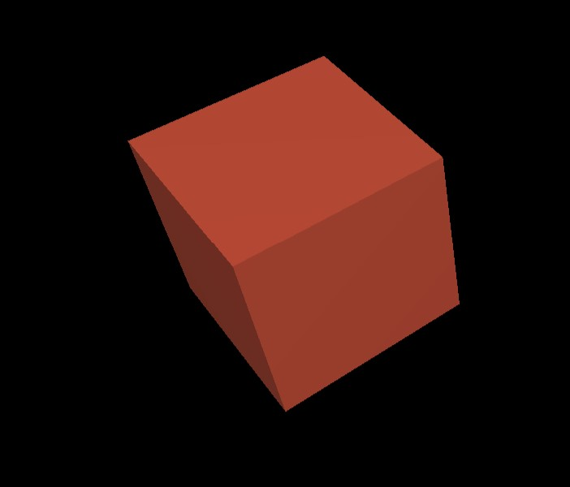


# Animate your scene

To make your objects move through time, we need to create a new `animate` function and set our animation properties within it.

You can animate just about any property of an object you want.

```
function animate() {
	requestAnimationFrame( animate );

    // slowly rotate the cube:

    cube.rotation.x += 0.01;
    cube.rotation.y += 0.01;

    // rotate the icosahedron a little faster in the opposite direction:

    icoMesh.rotation.z += -0.03
    icoMesh.rotation.y += -0.03

	renderer.render( scene, camera );
}
```

You must call the animate() function in order to tell the browser to use it:
```
animate();
```

Congratulations! Your scene should now look something like this:

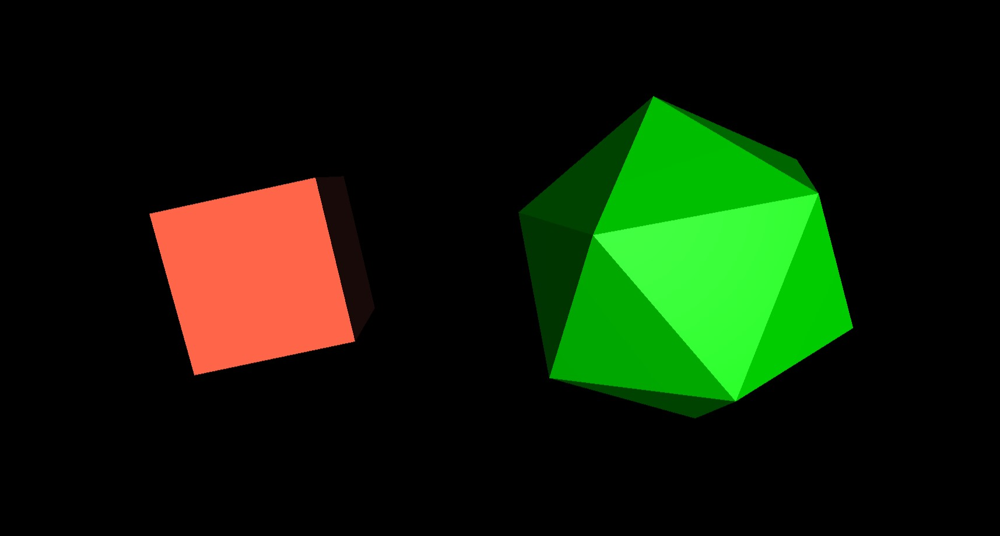


## Three.JS Helpers

Three.JS comes with a wide variety of scene helpers to assist in orienting the view of your scene. 

We can add a **Light Helper**, which shows us where in the scene our light objects are positioned.

Let's add a light helper to our `pointLight` object:

```
// Helpers

const lightHelper = new THREE.PointLightHelper(pointLight);

scene.add(lightHelper)
```
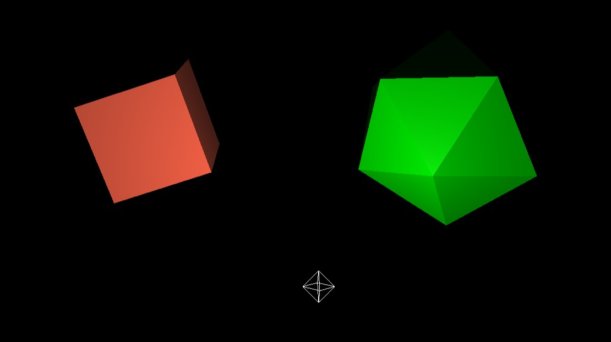


We can also add a **Grid Helper** to show the 3D axes of our scene.

```
const gridHelper = new THREE.GridHelper(200,50);

scene.add(gridHelper)
```


## Orbit Controls

Three.JS has various types of Control methods to allow you to add interactive functionality to your scene. 

Let us add an `Orbit Control`, which will allow us to move our camera and traverse our scene with mouse controls and zoom.

In order to add the Orbit Controls as a function, we need to import that package from the three.js dependencies. At the top of your document where you imported THREE.JS, (directly underneath `import * as THREE from 'three';`) add this line of code:

```
import { OrbitControls } from 'three/examples/jsm/controls/OrbitControls';
```

Then, under your `Helpers`, activate your orbit controls by declaring it as a constant:

```
// Orbit Control

const controls = new OrbitControls(camera, renderer.domElement)
```

Your orbit controls will not be functional until you add an `.update()` method to your new `controls` object WITHIN your `animate(){}` function:

```
function animate() {
	requestAnimationFrame( animate );

    // slowly rotate the cube:

    cube.rotation.x += 0.01;
    cube.rotation.y += 0.01;

    // rotate the icosahedron a little faster in the opposite direction:

    icoMesh.rotation.z += -0.03
    icoMesh.rotation.y += -0.03

    // ALLOWS YOUR ORBIT CONTROLS TO UPDATE LIVE IN REAL-TIME:
    controls.update()

	renderer.render( scene, camera );
}
```

When you refresh your server, you should now be able to click and drag to orbit the camera view of your scene!

## Scene Backgrounds

We can set our scene backgrounds to whatever we want, using regular image files. 

- create a new folder in your project and name it `images` 

- find a cool, high-resolution image that you would like to appear as the background of your scene. We are using this one:

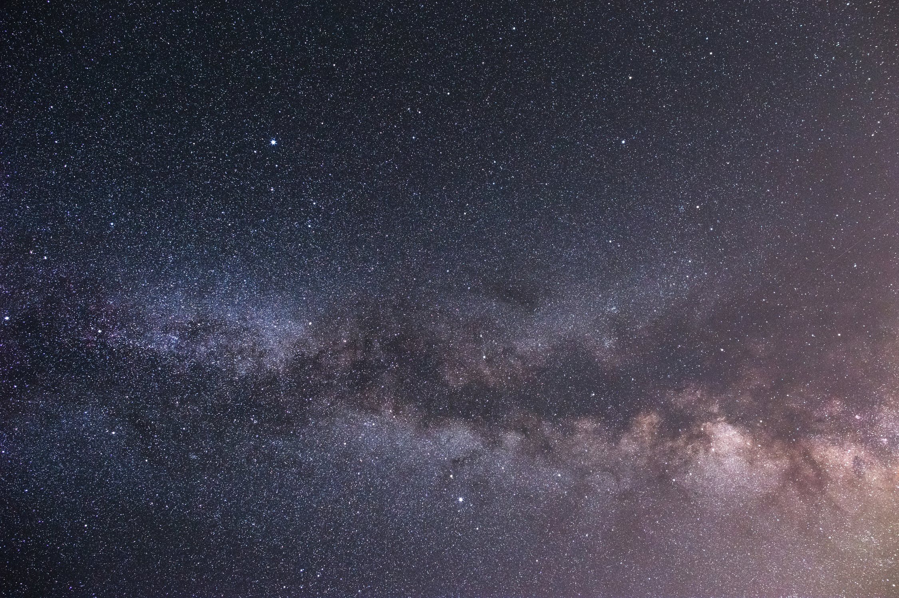

- save the image file of your choosing inside your new `/images` directory.

- create a new `Texture` object by referencing your image, and add it to the scene:

```
// Background

const spaceTexture = new THREE.TextureLoader().load('images/night_sky.jpg')

scene.background = spaceTexture;
```
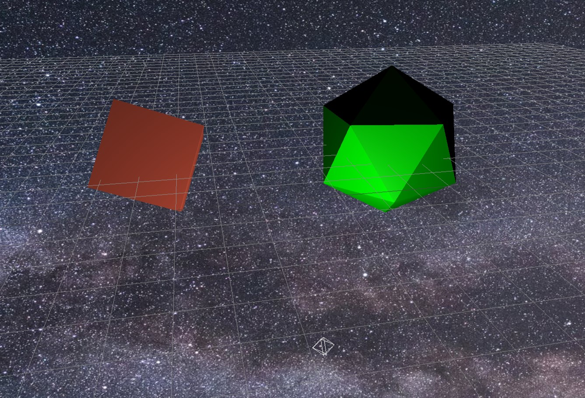


## Texture Mapping

In the world of 3D modeling, `Texture Mapping` refers to mapping flat images onto the surface of a 3D object. Three.JS allows us to do this by creating `Texture` objects and applying them to our 3D objects using methods.

Find an image file that you'd like to apply to the surface of a new object. We will be using this one:


Save your texture image file in your `/images` directory.

Now, in our `main.js`, let's create a new texture that we will map onto a new object:

```
// Object texture mapping

const smileTexture = new THREE.TextureLoader().load('images/smile.jpg')
```

Now, let's create a new `Sphere` object to map our new texture onto. 

**Remember** new objects require three basic components:

- a `geometry`
- a `material`
  - in this case, our new `BasicMaterial` will have a value of `{map: smileTexture}` instead of a color hex code.
- a `mesh`, which combines the `geometry` and `material` to create the final visible object.

```
// Object texture mapping

const smileTexture = new THREE.TextureLoader().load('images/smile.jpg')

const sphereGeometry = new THREE.SphereGeometry( 10, 22, 10 );

const smileMaterial = new THREE.MeshBasicMaterial({map: smileTexture})

const smileMesh = new THREE.Mesh(sphereGeometry, smileMaterial);

scene.add(smileMesh);
```

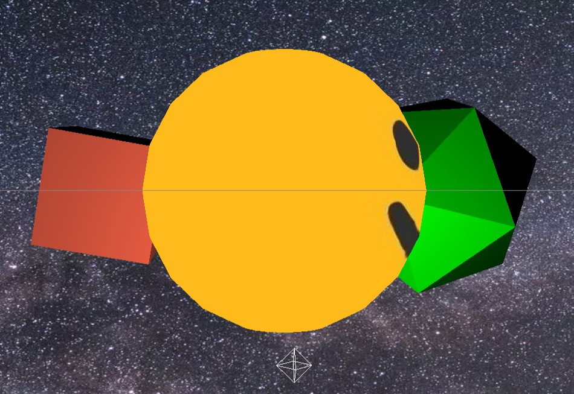

You can manipulate the object's static position, rotation, and size as you wish, the same as your other objects.

You can also add property changes to this new texture to be animated in real-time in your `animate()` function:

```
function animate() {
	requestAnimationFrame( animate );

    // slowly rotate the cube:

    cube.rotation.x += 0.01;
    cube.rotation.y += 0.01;

    // rotate the icosahedron a little faster in the opposite direction:

    icoMesh.rotation.z += -0.03
    icoMesh.rotation.y += -0.03

    // rotate the smiley sphere on the Y axis:

    smileMesh.rotation.y += 0.05

    controls.update()

	renderer.render( scene, camera );
}
```

### Normal Texture Mapping

Three.JS also allows you to create vivid textures to alter the surface shape of your mesh to create real, light-reactive textures on your objects.

To do this, we need to create a **normal**. 

**Normal mapping** in the 3D world refers to a texture mapping technique used for faking the lighting of bumps and dents – an implementation of bump mapping. It is used to add details without using more polygons.

To create a normal, you must first find a texture image you like that can be converted into a normal.

We used this site to generate and customize a texture:
[Texture Generator Online](http://cpetry.github.io/TextureGenerator-Online/)

Here's the texture we generated:

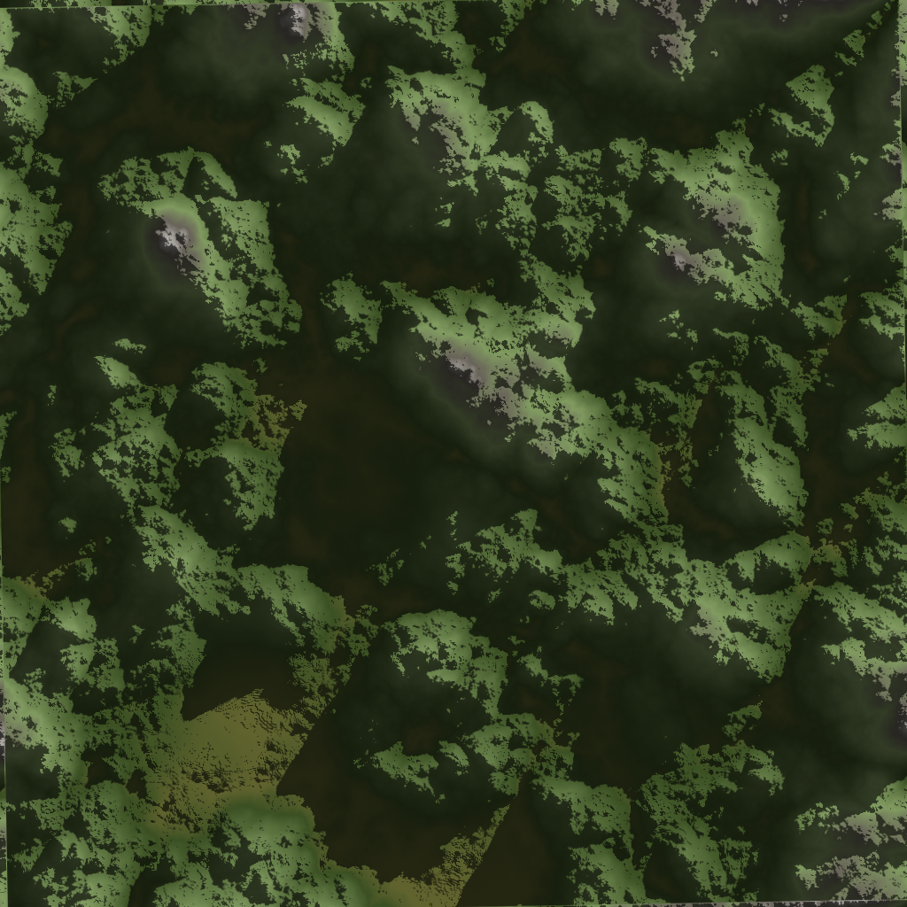

Now, we must convert this texture image file into a normal map. We used this site to upload our texture image file and have it converted into a normal:
[Normal Map Online](https://cpetry.github.io/NormalMap-Online/)

Here's the normal map that was generated from our image:
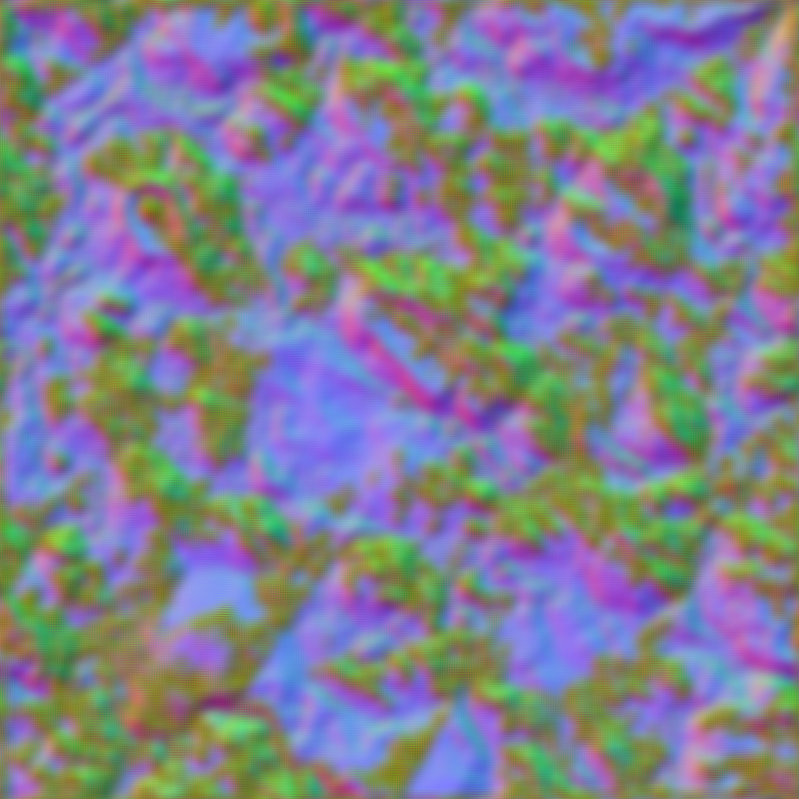

Now we need to create a new `normalTexture` object in our JavaScript by loading a new texture and loading in our normalMap image file:

```
const normalTexture = new THREE.TextureLoader().load('images/normals/textureNormal.png');
```

Now, to apply our normal map to a new object, we must apply our normal map image to the `normalMap` property within our new `MeshStandardMaterial`. 

```
// Normal Texture Map

const torusGeo = new THREE.TorusKnotGeometry( 5, 1, 250, 5, 9, 15 );
const torusMaterial = new THREE.MeshStandardMaterial( { 
  normalMap: normalTexture,
  roughness: 0,
  metalness: .8
} );

const torusKnot = new THREE.Mesh( torusGeo, torusMaterial );

scene.add( torusKnot );
torusKnot.position.y = 20

```

We also added a `roughness` and `metalness` property value to make our new object look more shiny and reflect light. Your scene should look something like this:

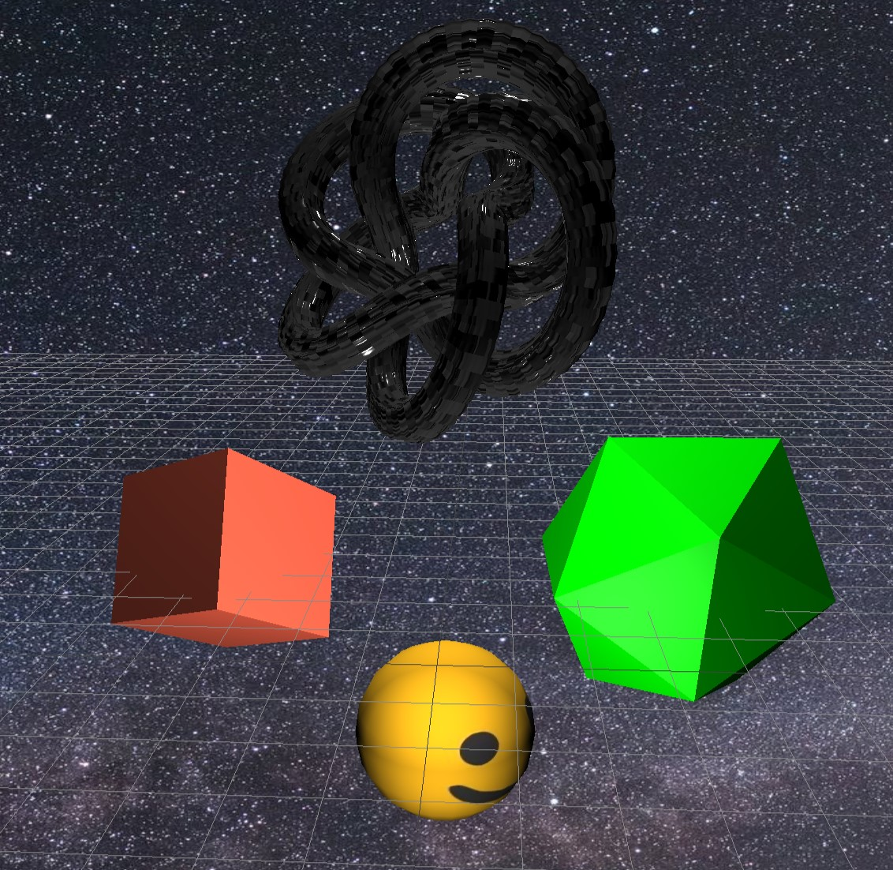


